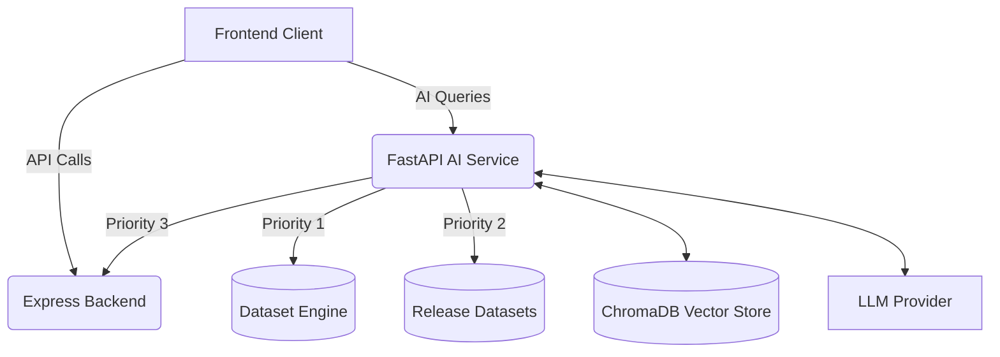

# InfoLand AI Service

## Project Overview
InfoLand AI Service is a dedicated AI microservice designed to provide advanced intelligence, natural language interactions, and deep insights for the InfoLand platform. It acts as the intelligent core, analyzing property data, generating reports, and powering the conversational AI assistant.

## Architecture
The InfoLand AI Service operates as a standalone microservice within the broader InfoLand ecosystem. It is decoupled from the main dataset engine and the Express backend, ensuring isolated scalability and specialized processing capabilities for machine learning and AI tasks.



## Purpose
The primary purpose of this service is to enrich the InfoLand user experience by:
- Providing semantic search and Retrieval-Augmented Generation (RAG) capabilities.
- Generating comprehensive property intelligence reports.
- Acting as a conversational AI assistant for users inquiring about property details, risks, and history.

## Tech Stack
- **Language**: Python 3.10+
- **Framework**: FastAPI
- **Vector Database**: ChromaDB
- **LLM/RAG Orchestration**: LangChain
- **Server**: Uvicorn
- **Package Management**: pip / virtual environments

## Folder Structure
```text
ai-service/
├── app/              # Core application logic
├── routers/          # API endpoint definitions
├── services/         # Business logic and AI pipelines
├── schemas/          # Pydantic models for request/response validation
├── database/         # Vector DB and data source connections
├── utils/            # Helper functions and logging
├── docs/             # Official architectural documentation
├── requirements.txt  # Project dependencies
└── main.py           # Application entry point
```

## Current Status
- Initial project foundation established.
- Architectural blueprint and documentation generated.
- Development phase starting (Module 01: Foundation).

## Roadmap
1. **Phase 1: Foundation** - Basic FastAPI setup, data source resolution, and health checks.
2. **Phase 2: Vector Database** - ChromaDB integration, embeddings, and data ingestion from datasets.
3. **Phase 3: RAG Engine** - LangChain pipelines, retrievers, and prompt templates.
4. **Phase 4: Property Intelligence** - Automated analysis and report generation modules.
5. **Phase 5: AI Assistant** - Conversational interfaces, memory, and streaming responses.

## Development Philosophy
- **Single Source of Truth**: The Dataset Engine is the authoritative source for all property data. The AI service only reads; it never modifies.
- **Modularity**: Separation of concerns across routers, services, and schemas.
- **Reliability**: Implement strong fallback mechanisms for data access.
- **Grounded AI**: Prevent hallucinations; responses must be strictly tied to retrieved context.
