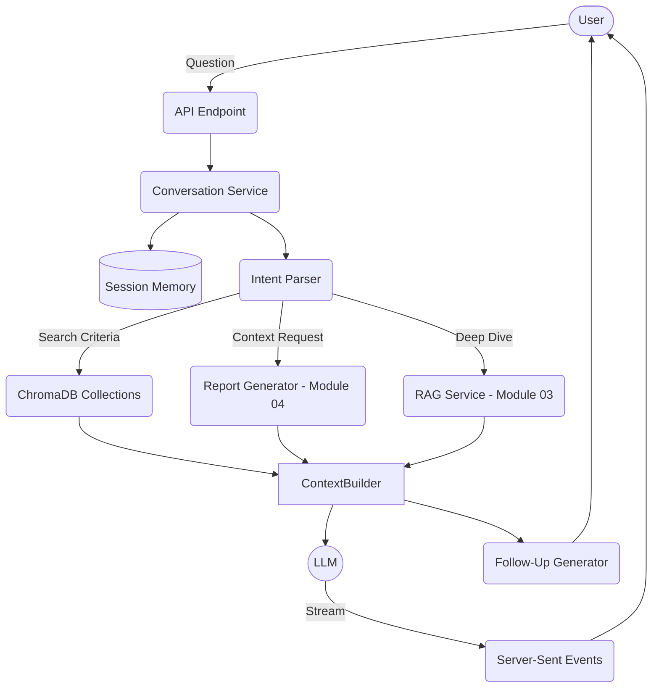
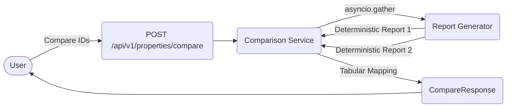

# Module 05: Conversational AI Assistant Walkthrough

The Conversational AI Assistant elevates the deterministic capabilities of the **Property Intelligence Engine** (Module 04) and **RAG Pipeline** (Module 03) by offering a fluid, session-aware interactive experience.

## Architecture Overview

The system strictly abides by the "AI as an explainer" philosophy. Business logic (Risk, Verification, Recommendations) remains purely deterministic. The AI orchestrates the retrieval of these structured facts and communicates them via natural language.

## Conversation Flow

1. **Session & Intent Analysis:**
   Every incoming `ChatRequest` binds to a unique `session_id`. If `property_id` is supplied, it becomes the anchored "active property". The `IntentParser` runs an LLM chain to determine whether the user is asking about a specific property, requesting a search query, comparing properties, or asking general real estate questions.

2. **Memory Persistence:**
   The `ConversationMemory` (Memory Service) caches `ChatMessage` arrays linked to the session. When the LLM generates a response, the history context is prepended, allowing it to easily resolve pronouns (e.g., "Who owns it?", "Does it have active loans?"). The memory uses a configurable expiration to sweep out inactive sessions.

3. **Deterministic Search vs Explanation:**
   If the user asks "Find properties in Kokapet with low risk", the `IntentParser` extracts structured filters `{"region": "Kokapet", "future_risk_tier": "Low"}`. Instead of the LLM searching blindly, the `ConversationService` uses `CollectionManager` to execute a structured query on the ChromaDB `properties` collection. The returned matches serve as the pure evidence for the LLM to explain.

4. **Streaming Execution:**
   Responses are yielded token-by-token via FastAPI's `StreamingResponse` integrated with LangChain's `.astream()` method. The final event of the stream emits the structured citations, completion markers, and deterministic follow-up questions.

## Property Comparison Flow

The property comparison engine runs purely without LLM overhead. When given an array of property IDs, it concurrently invokes the `ReportGeneratorService` bypassing the `include_ai_summary` overhead. It maps the deterministic fields—such as Risk Tier, Verification Status, and Owner—into a scalable `CompareResponse` schema.

## Explainability and Fallbacks
The context provided to the LLM carries the absolute JSON output of the `PropertyIntelligenceReport`.
- If the report states `risk_tier: High`, the LLM is explicitly instructed to cite the report structure instead of fabricating external calculations.
- Deterministic follow-up suggestions generated by `FollowUpGenerator` inspect arrays in the report structure (e.g., `if len(report.legal.active_litigation) > 0`, suggest: "Can you detail the active legal disputes?").
