# Data Flow Architecture

The data flow within InfoLand AI strictly enforces the **Backend as the Single Source of Truth**. The frontend is purely a presentation layer that triggers requests, caches responses, and visualizes the output.

## Full Stack Sequence Diagram

```mermaid
sequenceDiagram
    autonumber
    
    actor User
    participant ReactUI as React Component
    participant Redux as Redux Slice (Thunk)
    participant Router as Express Route
    participant Controller as API Controller
    participant Service as Business Logic
    participant Repo as Repository
    participant Mongo as MongoDB
    
    User->>ReactUI: Opens Property Report
    ReactUI->>Redux: dispatch(fetchDetailedPlotById(id))
    Redux->>Router: HTTP GET /api/v1/properties/:id
    Router->>Controller: Route Match & Joi Validation
    Controller->>Service: getDetailedProperty(id)
    Service->>Repo: findPropertyWithDetails(id)
    
    rect rgb(30, 41, 59)
        Note over Repo,Mongo: MongoDB Aggregation Pipeline
        Repo->>Mongo: $match (property_id)
        Mongo-->>Repo: Core Property Data
        Repo->>Mongo: $lookup (ownership_histories)
        Mongo-->>Repo: Joined Ownership
        Repo->>Mongo: $lookup (court_cases)
        Mongo-->>Repo: Joined Legal Cases
    end
    
    Repo-->>Service: Aggregated Document
    Service-->>Controller: DTO (Data Transfer Object)
    Controller-->>Redux: HTTP 200 OK (JSON Response)
    Redux-->>Redux: Cache & Normalize Data
    Redux-->>ReactUI: useSelector (Trigger Re-render)
    ReactUI->>User: Display Property Intelligence Report
```

## Step-by-Step Explanation

1.  **Dataset Ingestion:** Off-band scripts (Dataset Engine) populate the raw collections in MongoDB.
2.  **API Request:** The React UI triggers a Redux asynchronous Thunk.
3.  **Controller Validation:** Express routes the request to the relevant controller, which validates inputs (e.g., ensuring an ID is valid) using `Joi`.
4.  **Service Orchestration:** The controller hands off to the Service layer, which coordinates what data needs to be fetched.
5.  **Repository Fetch:** The Service calls the Repository, which constructs Mongoose queries or aggregation pipelines. The repository is the *only* layer allowed to speak to the database.
6.  **Redux Normalization:** The frontend receives the JSON payload. Redux normalizes it (flattening structures if needed) to ensure UI components don't have to parse deeply nested backend schemas.
7.  **React Render:** Components mapped via `useSelector` automatically re-render when the Redux store updates, populating Maps, Charts, or Tables.
