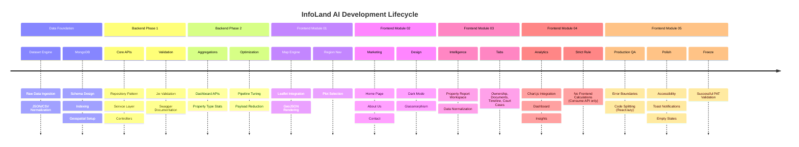

# Implementation Timeline

The development of InfoLand AI followed a strict chronological sequence to ensure robust data integrity before UI implementation.

## Chronological Breakdown

1.  **Dataset Engine & Database Layout:** We started at the lowest level, ensuring we had valid real-world data structured correctly in MongoDB.
2.  **Backend APIs:** Once data existed, we exposed it securely through Express APIs, documenting everything in Swagger.
3.  **Frontend Foundation (Mod 01 & 02):** Built the basic routing, map interface, and marketing shell.
4.  **Frontend Data Integration (Mod 03 & 04):** Wired the Redux Toolkit to the backend APIs, populating the deep Property Reports and the Analytics Dashboards.
5.  **Production Readiness (Mod 05):** With all features complete, we optimized performance, caught edge cases, and locked the codebase for deployment.
